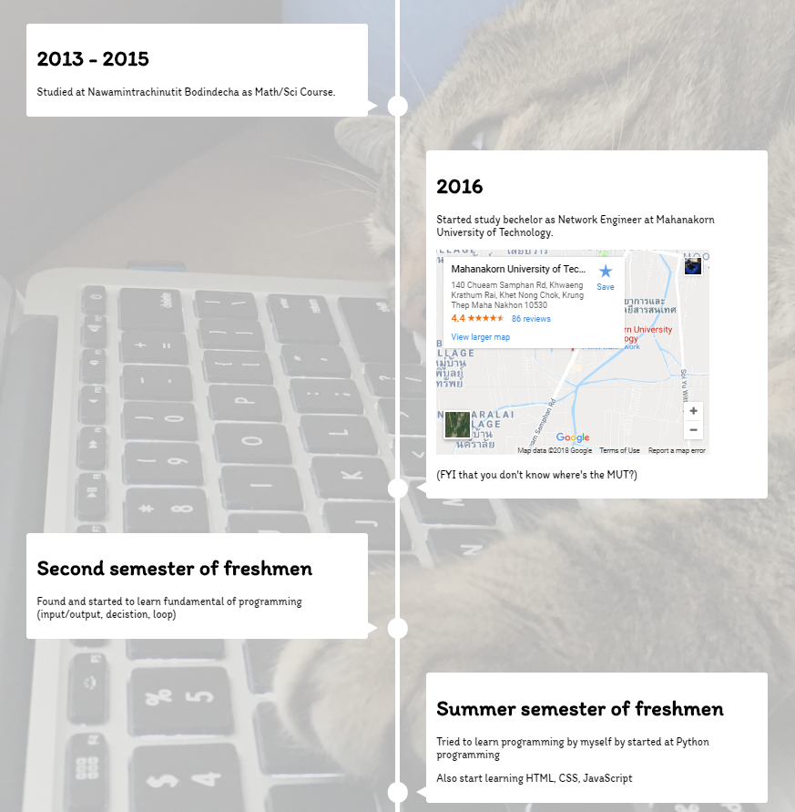

## Willpower blog

This is my first version of my blog. Implement with Next.js

### Theme

I love cat. So I use cat for background and logo.
But it not much modern as I wanted. So this project is unmaintained.

### What I finished before unmaintained.

[x] Implement Next.js
[x] Cat Logo using Vector type
[x] Menu with functional paradigm
[x] footer
[x] styled-components with server rendering [See my code](https://github.com/Ryan-Willpower/willpower-blog-v1/blob/master/pages/_document.js)
[x] Custom App.js for Implement Header and Footer on every pages [wanted to see this too?](https://github.com/Ryan-Willpower/willpower-blog-v1/blob/master/pages/_app.js)
[x] Timeline

[ ] blog page
[ ] portfolio pages
